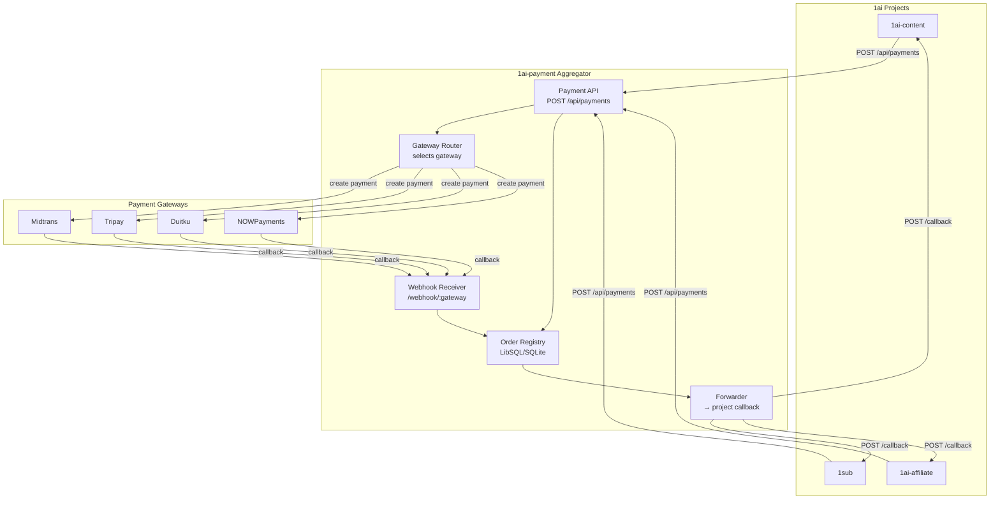
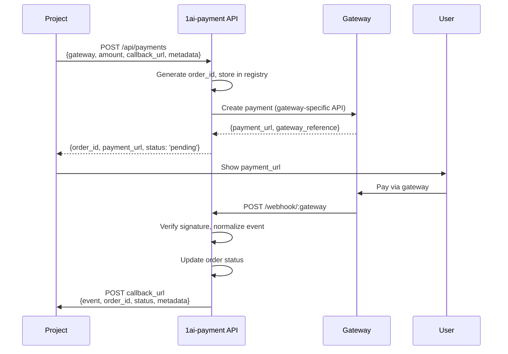
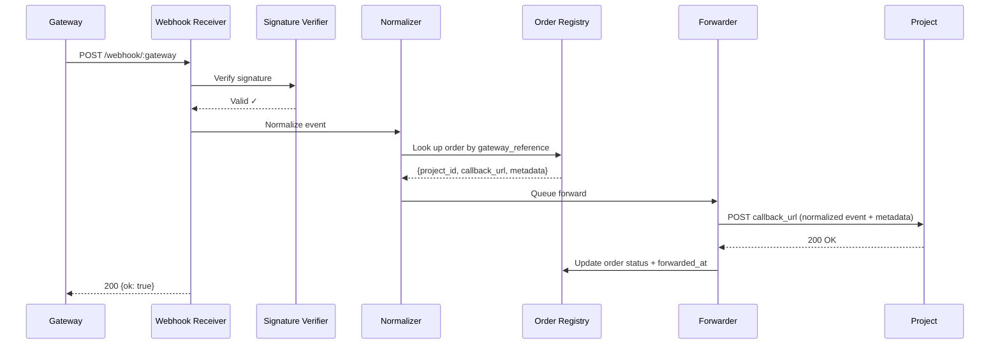
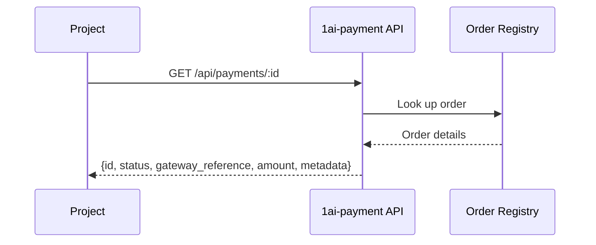
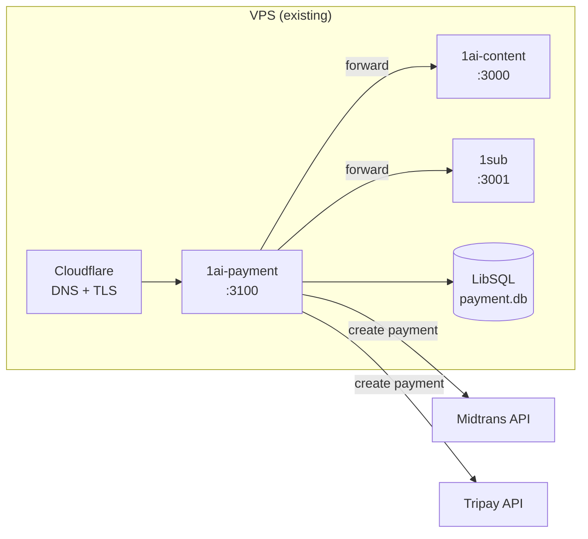

# 01 — Architecture

## System Architecture



## Data Flow

### 1. Payment Creation (Project → 1ai-payment → Gateway)



### 2. Webhook Processing (Gateway → 1ai-payment → Project)



### 3. Payment Status Check



### 4. Signature Verification (Per Gateway)

| Gateway | Algorithm | Header | Notes |
|---------|-----------|--------|-------|
| Midtrans | SHA-512(order_id + status_code + gross_amount + server_key) | Body field `signature_key` | Server key from env |
| Tripay | HMAC-SHA256(JSON body, private_key) | `X-Signature` header | Private key from env |
| Duitku | MD5(merchant_code + amount + order_id + api_key) | Body field `signature` | API key from env |
| NOWPayments | HMAC-SHA512(JSON body, secret_key) | `x-now-sig` header | IPN secret from env |

### 5. Event Normalization

All gateway-specific events normalized to:

```typescript
interface NormalizedPaymentEvent {
  gateway: string;            // 'midtrans' | 'tripay' | 'duitku' | 'nowpayments'
  order_id: string;           // 1ai-payment order ID
  gateway_reference: string;  // Gateway's transaction/reference ID
  status: PaymentStatus;      // 'success' | 'pending' | 'failed' | 'expired' | 'cancelled'
  amount: number;             // In original currency
  currency: string;           // IDR, USD, etc.
  payment_method: string;     // bank_transfer, qris, crypto, etc.
  paid_at: string | null;     // ISO timestamp
  metadata: Record<string, unknown>; // Project's metadata (passthrough)
}
```

**SECURITY NOTE:** Raw gateway payloads are NEVER persisted or logged.

## Database Schema

```sql
-- Orders created via API
CREATE TABLE orders (
  id TEXT PRIMARY KEY,               -- UUID (1ai-payment order ID)
  project_id TEXT NOT NULL,          -- e.g., '1ai-content', '1sub'
  project_order_id TEXT,             -- Project's internal order ID (optional)
  callback_url TEXT NOT NULL,        -- Where to forward events
  gateway TEXT NOT NULL,             -- midtrans, tripay, duitku, nowpayments
  gateway_reference TEXT,            -- Gateway's transaction ID
  amount INTEGER NOT NULL,           -- Amount in smallest currency unit
  currency TEXT DEFAULT 'IDR',
  payment_method TEXT,               -- bank_transfer, qris, crypto, etc.
  payment_url TEXT,                  -- Gateway's payment URL
  status TEXT DEFAULT 'pending',     -- pending, success, failed, expired, cancelled
  metadata TEXT,                     -- JSON string (project's arbitrary data)
  idempotency_key TEXT UNIQUE,       -- For duplicate prevention
  created_at TEXT DEFAULT (datetime('now')),
  updated_at TEXT DEFAULT (datetime('now')),
  forwarded_at TEXT,
  forward_attempts INTEGER DEFAULT 0
);

-- Webhook event log (audit trail — NO raw payloads)
CREATE TABLE webhook_events (
  id TEXT PRIMARY KEY,
  gateway TEXT NOT NULL,
  order_id TEXT,
  gateway_reference TEXT,
  status TEXT,
  signature_valid INTEGER DEFAULT 0,
  forwarded INTEGER DEFAULT 0,
  forward_status INTEGER,
  created_at TEXT DEFAULT (datetime('now'))
);

-- Project registrations (for multi-tenant future)
CREATE TABLE projects (
  id TEXT PRIMARY KEY,               -- e.g., '1ai-content'
  name TEXT NOT NULL,
  api_key_hash TEXT NOT NULL,        -- Hashed API key
  webhook_secret TEXT NOT NULL,      -- For signing forwarded events
  default_callback_url TEXT,         -- Default callback if not specified per-payment
  active INTEGER DEFAULT 1,
  created_at TEXT DEFAULT (datetime('now'))
);

-- Indexes
CREATE INDEX idx_orders_project ON orders(project_id);
CREATE INDEX idx_orders_status ON orders(status);
CREATE INDEX idx_orders_gateway ON orders(gateway);
CREATE INDEX idx_orders_idempotency ON orders(idempotency_key);
CREATE INDEX idx_webhook_events_gateway ON webhook_events(gateway);
CREATE INDEX idx_webhook_events_created ON webhook_events(created_at);
```

## Deployment



- **Port:** 3100 (configurable)
- **TLS:** Via Cloudflare (existing setup)
- **Database:** Local LibSQL file (`data/payment.db`)
- **Process:** PM2 or systemd

## Failure Modes

| Failure | Impact | Mitigation |
|---------|--------|------------|
| Gateway API down | Payment creation fails | Return 503, project retries or uses different gateway |
| Project callback down | Events queued, retry with backoff | 3 retries: 5s, 30s, 300s |
| Gateway signature invalid | Event rejected (401) | Log + admin alert |
| Order not found | Event logged, not forwarded | Return 200 to gateway (don't retry) |
| Database down | All operations fail | Return 503, gateway will retry |
| Duplicate webhook | Idempotent — same result | Order status check before update |
| Duplicate payment request | Same result | Idempotency key check |
