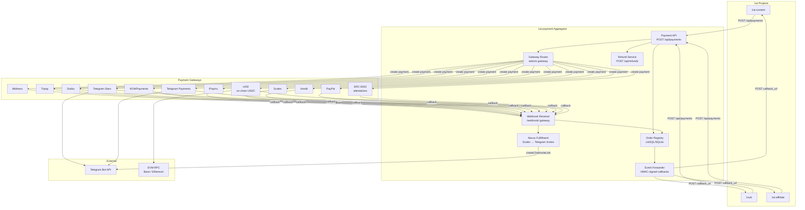
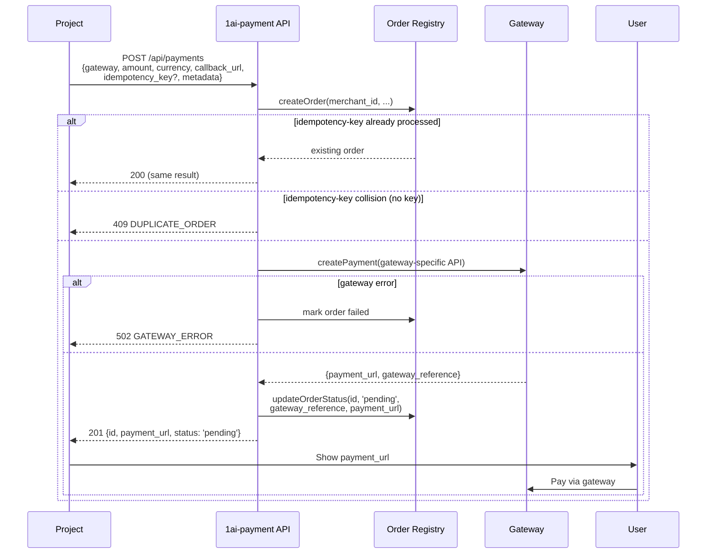
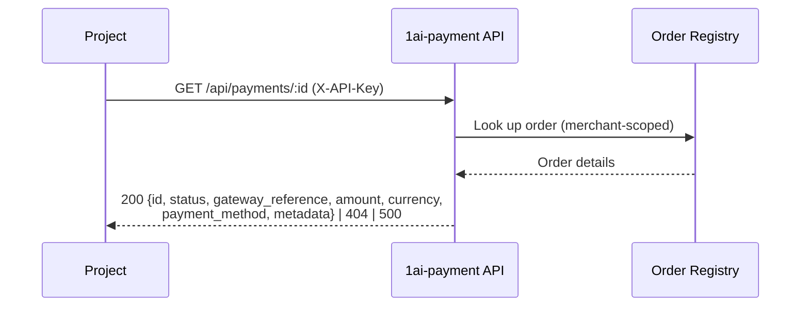
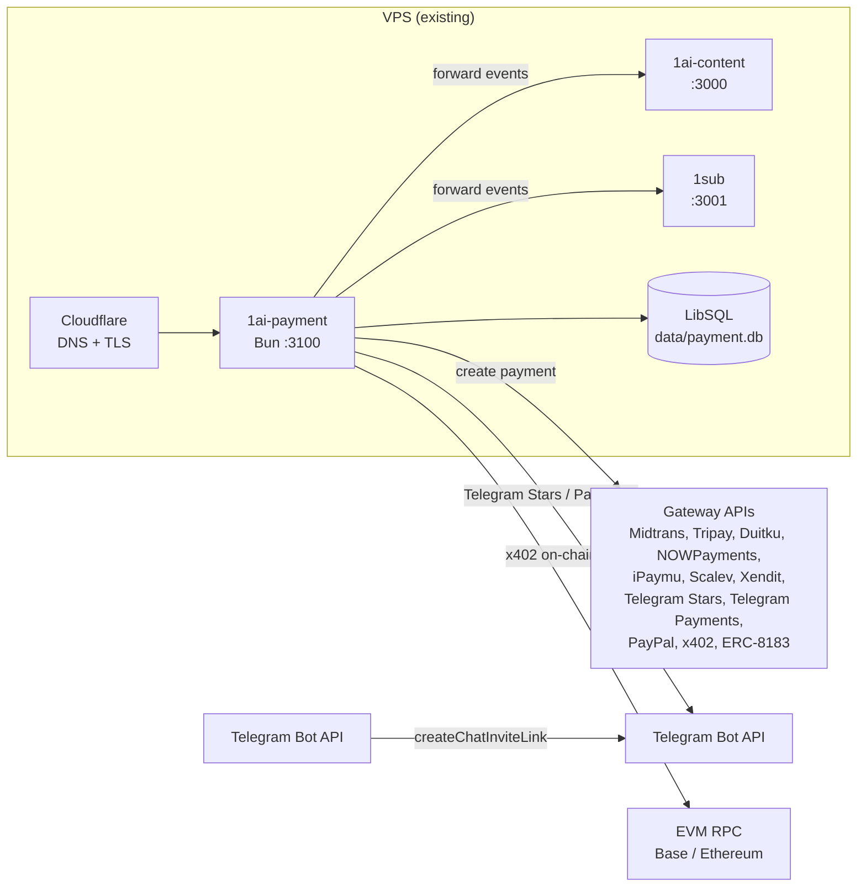

# 01 — Architecture

## System Architecture


```mermaid
graph TB
    subgraph "1ai Projects"
        IC[1ai-content]
        SUB[1sub]
        AF[1ai-affiliate]
    end

    subgraph "1ai-payment Aggregator"
        API[Payment API<br/>POST /api/payments]
        GW[Gateway Router<br/>selects gateway]
        REG[Order Registry<br/>LibSQL/SQLite]
        WH[Webhook Receiver<br/>/webhook/:gateway]
        FW[Event Forwarder<br/>HMAC-signed callbacks]
        RF[Refund Service<br/>POST /api/refunds]
        NX[Nexus Fulfillment<br/>Scalev → Telegram invites]
    end

    subgraph "Payment Gateways"
        MT[Midtrans]
        TP[Tripay]
        DK[Duitku]
        NP[NOWPayments]
        IM[iPaymu]
        SV[Scalev]
        XE[Xendit]
        TS[Telegram Stars]
        TPG[Telegram Payments]
        PP[PayPal]
        X4[x402<br/>on-chain USDC]
        ERC[ERC-8183<br/>attestations]
    end

    subgraph "External"
        TG[Telegram Bot API]
        RPC[EVM RPC<br/>Base / Ethereum]
    end

    IC -->|POST /api/payments| API
    SUB -->|POST /api/payments| API
    AF -->|POST /api/payments| API

    API --> GW
    API --> REG
    API --> RF
    GW -->|create payment| MT
    GW -->|create payment| TP
    GW -->|create payment| DK
    GW -->|create payment| NP
    GW -->|create payment| IM
    GW -->|create payment| SV
    GW -->|create payment| XE
    GW -->|create payment| TS
    GW -->|create payment| TPG
    GW -->|create payment| PP
    GW -->|create payment| X4
    GW -->|create payment| ERC

    MT -->|callback| WH
    TP -->|callback| WH
    DK -->|callback| WH
    NP -->|callback| WH
    IM -->|callback| WH
    SV -->|callback| WH
    XE -->|callback| WH
    TS -->|callback| WH
    TPG -->|callback| WH
    PP -->|callback| WH
    X4 -->|callback| WH
    ERC -->|callback| WH

    TS --> TG
    TPG --> TG
    X4 --> RPC

    WH --> REG
    REG --> FW
    WH --> NX
    NX -->|createChatInviteLink| TG
    FW -->|POST callback_url| IC
    FW -->|POST callback_url| SUB
    FW -->|POST callback_url| AF
```

## Data Flow

### 1. Payment Creation (Project → 1ai-payment → Gateway)

`POST /api/payments` is synchronous: the response is returned only after the
gateway has responded with a payment URL. Requests must carry the merchant API
key (`X-API-Key`) and should carry an `idempotency-key` (body field or header)
scoped to the merchant for duplicate prevention.


```mermaid
sequenceDiagram
    participant P as Project
    participant A as 1ai-payment API
    participant DB as Order Registry
    participant G as Gateway
    participant U as User

    P->>A: POST /api/payments<br/>{gateway, amount, currency, callback_url,<br/>idempotency_key?, metadata}
    A->>DB: createOrder(merchant_id, ...)
    alt idempotency-key already processed
        DB-->>A: existing order
        A-->>P: 200 (same result)
    else idempotency-key collision (no key)
        A-->>P: 409 DUPLICATE_ORDER
    else
        A->>G: createPayment(gateway-specific API)
        alt gateway error
            A->>DB: mark order failed
            A-->>P: 502 GATEWAY_ERROR
        else
            G-->>A: {payment_url, gateway_reference}
            A->>DB: updateOrderStatus(id, 'pending',<br/>gateway_reference, payment_url)
            A-->>P: 201 {id, payment_url, status: 'pending'}
            P->>U: Show payment_url
            U->>G: Pay via gateway
        end
    end
```

Responses: `201` created, `200` idempotent hit, `400` INVALID_BODY (unknown
gateway / validation), `409` DUPLICATE_ORDER, `502` GATEWAY_ERROR. Every API
error uses a unified envelope `{ success: false, error: { code, message } }`
(handled via `app.onError` / `app.notFound`; codes include `INVALID_BODY`,
`DUPLICATE_ORDER`, `GATEWAY_ERROR`, `ORDER_NOT_FOUND`, `FORBIDDEN`,
`NOT_FOUND`, `INTERNAL_ERROR`). The idempotency *lookup* is merchant-scoped,
but the `UNIQUE` constraint on `orders.idempotency_key` is global — reusing a
key already taken by a *different* merchant also yields
`409 DUPLICATE_ORDER`.

### 2. Webhook Processing (Gateway → 1ai-payment → Project)

Every gateway has its own route under `/webhook/:gateway`. All incoming
headers are lower-cased before signature verification. Webhooks are rate
limited at 120 req/min per merchant or IP.

```mermaid
sequenceDiagram
    participant G as Gateway
    participant W as Webhook Receiver
    participant V as Signature Verifier
    participant N as Normalizer
    participant DB as Order Registry
    participant F as Forwarder
    participant P as Project

    G->>W: POST /webhook/:gateway (raw body + headers)
    W->>W: Parse JSON — invalid → 400
    W->>V: verifySignatureRaw(rawBody, headers)
    V-->>W: invalid → 401 (rejected, no retry)
    W->>N: normalizeEvent(body)
    N-->>W: throws → 400
    W->>DB: Look up order<br/>(scalev: by order_id; then by gateway_reference; then by order_id)
    alt order not found
        W->>DB: INSERT webhook_events<br/>(raw_payload, signature_valid=1)
        Note over W,NX: scalev: handleNexusPayment()<br/>creates subscription + Telegram invite
        W-->>G: 200 {ok: true} (not forwarded)
    else order found
        W->>N: Re-normalize with order.metadata
        W->>DB: INSERT webhook_events first (dedup check)
        alt duplicate (UNIQUE partial index)
            W-->>G: 200 (idempotent skip)
        else
            W->>DB: updateOrderStatus(id, status,<br/>gateway_reference)
            W->>F: forwardEvent(...) (async, fire-and-forget)
            F->>P: POST callback_url (signed payload)
            alt success
                F->>DB: markForwarded(id, statusCode, attempts)
            else retries exhausted
                F->>DB: INSERT dead_letter_events<br/>+ markForwarded(id, 0, 3)
            end
            W-->>G: 200 {ok: true}
        end
    end
```

Key properties:

- **Signature verification is mandatory.** A webhook with an invalid signature
  is rejected with `401` before any state change. Any route not matching a
  known gateway returns `501`. The body is read as raw text first, and HMAC
  gateways verify over the exact raw bytes (`verifySignatureRaw(rawBody,
  headers)`).
- **Transport gate: HTTPS when `REQUIRE_HTTPS` is enabled.** The
  `REQUIRE_HTTPS` config flag (env var, default `true` when
  `NODE_ENV=production`, `false` otherwise) rejects a webhook over plain
  HTTP with `400` unless the `x-forwarded-proto: https` header is present
  (TLS terminates at Cloudflare).
- **Forwarding is async and fire-and-forget.** The receiver replies `200` to
  the gateway immediately; the project callback runs in the background with
  up to 3 retries (`5s`, `30s`, `300s` backoff, in-process sleep). There is no
  durable queue: after the final failure the event is written to
  `dead_letter_events` and `forward_attempts` is set to 3. Dead letters can be
  replayed via `replayDeadLetter(id)`, which re-forwards and stamps
  `replayed_at` on success.
- **Telegram gateways fail closed on forwarding.** If the merchant's
  `webhook_secret` is missing/empty, the event is skipped (not forwarded) and
  the gateway still receives `200` — verified events are never forwarded
  unsigned.
- **Idempotent by construction.** `webhook_events` has a partial UNIQUE index
  on `(order_id, gateway, status)`, so a re-delivered webhook for a *known*
  order hits the unique violation, is logged, and returns `200` without
  double-processing. For unknown orders the receiver dedupes with a manual
  fingerprint lookup on `(gateway, order_id / gateway_reference)` — a
  non-atomic check (TOCTOU), an accepted residual since duplicate unknown
  events only re-insert a log row and are never forwarded.
- **Unknown orders are recorded, not dropped.** They are inserted into
  `webhook_events` (never forwarded), and the gateway gets `200` so it stops
  retrying. For `scalev`, unknown orders additionally trigger Nexus
  fulfillment (see [Nexus Subsystem](#nexus-subsystem)).

Forwarded payload is signed with `HMAC-SHA256` (hex) using the merchant's
`webhook_secret` and delivered with the headers `X-Payment-Signature` and
`X-Payment-Event`, event type `payment.<status>`. The callback body contains:
`event`, `gateway`, `order_id`, `project_order_id`, `gateway_reference`,
`status`, `amount`, `currency`, `payment_method`, `paid_at`, `metadata`,
`timestamp`. Each HTTP attempt times out after 30 seconds.

### 3. Payment Status Check


```mermaid
sequenceDiagram
    participant P as Project
    participant A as 1ai-payment API
    participant DB as Order Registry

    P->>A: GET /api/payments/:id (X-API-Key)
    A->>DB: Look up order (merchant-scoped)
    DB-->>A: Order details
    A-->>P: 200 {id, status, gateway_reference, amount, currency,<br/>payment_method, metadata} | 404 | 500
```

`GET /api/transactions` (filters: status, gateway, from, to, limit, offset) and
`GET /api/webhook-deliveries` (join of `webhook_events` + `orders`) provide
listing for the merchant. `GET /api/gateways` and
`GET /api/gateways/:gateway/methods` are unauthenticated listing endpoints.
`GET /api/merchants` returns only the calling merchant's own record (still
wrapped in an array). `GET /api/payments/:id` returns `404 ORDER_NOT_FOUND`
for an order belonging to a different merchant (no existence leak).
`GET /metrics` is admin-only (`X-Admin-Key`), separate from the merchant
API.

### 4. Refunds (Project → 1ai-payment → Gateway)

`POST /api/refunds` (auth required) creates a full or partial refund. The
order must exist, belong to the requesting merchant, be in status `success`,
and the refunded amount must not exceed `order.amount`. A cumulative guard
also applies: the sum of existing non-failed refunds for the order plus the
new amount must not exceed `order.amount`. Gateway refund failures (other
than `REFUND_NOT_SUPPORTED`) record the refund with status `failed`; a full
refund (`refundAmount >= order.amount`) additionally sets the order status
to `refunded`.

```mermaid
sequenceDiagram
    participant P as Project
    participant A as 1ai-payment API
    participant DB as Order Registry
    participant G as Gateway

    P->>A: POST /api/refunds {order_id, amount, reason?}
    A->>DB: Validate order (owner, status='success',<br/>cumulative refunds + amount ≤ order.amount)
    alt gateway implements refundPayment + has gateway_reference
        A->>G: refundPayment(order, amount)
        alt gateway refunded
            G-->>A: gateway_refund_id
            A->>DB: INSERT refunds; full refund → order status 'refunded'
            A-->>P: 201 {id, status}
        else REFUND_NOT_SUPPORTED
            A->>DB: INSERT refunds (status 'pending', manual handling)
            A-->>P: 201 {id, status: 'pending'}
        end
        else other gateway error
            A->>DB: INSERT refunds (status 'failed', failure recorded)
            A-->>P: 400/404 (error mapping)
    else no gateway refund support / no reference
        A->>DB: INSERT refunds (status 'pending', manual handling)
        A-->>P: 201 {id, status: 'pending'}
    end
```

`GET /api/refunds` lists refunds for the merchant. Gateway errors containing
`not found` map to `404`; all other gateway errors map to `400`.

### 5. Event Normalization

All gateway-specific callbacks are normalized into a single shape before
forwarding:

```typescript
interface NormalizedPaymentEvent {
  gateway: string;            // 'midtrans' | 'tripay' | 'duitku' | 'nowpayments'
                              // | 'ipaymu' | 'scalev' | 'xendit'
                              // | 'telegram_stars' | 'telegram_payments'
                              // | 'paypal' | 'x402' | 'erc8183'
  order_id: string;           // 1ai-payment order ID
  gateway_reference: string;  // Gateway's transaction/reference ID
  status: PaymentStatus;      // 'success' | 'pending' | 'failed'
                              // | 'expired' | 'cancelled' | 'refunded'
  amount: number;             // In original currency
  currency: string;           // IDR, USD, etc.
  payment_method: string;     // bank_transfer, qris, crypto, etc.
  paid_at: string | null;     // ISO timestamp
  metadata: Record<string, unknown>; // Project's metadata (passthrough)
}
```

Project `metadata` is attached at order creation, stored on the order, and
passed through the full lifecycle: create → callback → forward. Normalized
statuses follow the gateway conventions — e.g. Duitku `resultCode`
`00`→success / `01`→pending / else failed; ERC-8183 released→success,
pending/funded/in_progress/completed/attested→pending, disputed→failed,
cancelled→cancelled; x402 status comes from the cached on-chain verification
(5-minute TTL) — the client-supplied `verified` flag is never trusted.

### 6. Signature Verification (Per Gateway)

All 13 gateways are normalized into a single NormalizedPaymentEvent
use timing-safe comparison (`crypto.timingSafeEqual`).

| Gateway | Algorithm | Where the signature lives | Notes |
|---------|-----------|---------------------------|-------|
| Midtrans | SHA-512(order_id + status_code + gross_amount + server_key) | Body field `signature_key` | `MIDTRANS_SERVER_KEY` from env; `gateway_reference` = payload `order_id` |
| Tripay | HMAC-SHA256(JSON.stringify(body), private_key), hex | Header `x-signature` (also `X-Signature`) | `TRIPAY_PRIVATE_KEY` from env |
| Duitku | MD5(merchantCode + amount + merchantOrderId + api_key) | Body field `signature` | `DUITKU_API_KEY` from env |
| NOWPayments | HMAC-SHA512(JSON.stringify(body), ipn_secret), hex | Header `x-now-sig` | `NOWPAYMENTS_IPN_SECRET` from env |
| iPaymu | SHA-256(va_key + order_id + status + amount + api_key) | Body field `signature` | `IPAYMU_VA_KEY` + `IPAYMU_API_KEY` from env |
| Scalev | HMAC-SHA256(JSON.stringify(body), webhook_secret), hex | Header `x-scalev-signature` | `SCALEV_WEBHOOK_SECRET` from env |
| Xendit | Constant-time header comparison | Header `x-callback-token` | `XENDIT_CALLBACK_TOKEN` from env |
| Telegram Stars | Constant-time header comparison | Header `x-telegram-bot-api-secret-token` | `TELEGRAM_WEBHOOK_SECRET` from env; **skipped** when the secret is unset (returns true) |
| Telegram Payments | Constant-time header comparison | Header `x-telegram-bot-api-secret-token` | Same secret + skip-when-unset behavior as Stars |
| PayPal | External API verification | Headers `paypal-transmission-id`, `paypal-transmission-time`, `paypal-transmission-sig`, `paypal-cert-url` | `POST {base}/v1/notifications/verify-webhook-signature` with a Bearer token from `PAYPAL_CLIENT_ID`/`PAYPAL_CLIENT_SECRET`; success iff `verification_status === "SUCCESS"`; needs `PAYPAL_WEBHOOK_ID` + `PAYPAL_WEBHOOK_SECRET`; base `api-m.sandbox.paypal.com` / `api-m.paypal.com` |
| x402 | On-chain USDC verification via RPC (viem) | Body fields (`network`, `tx_hash`, `asset`, `amount`, `payer`) | No HMAC — `verifySignature` resolves the expected USDC contract (`X402_USDC_ADDRESS` or per-chain default) and the configured `X402_WALLET_ADDRESS`, fetches the tx receipt, and requires a `Transfer` to the wallet of ≥ the declared amount; tx must have succeeded on-chain; declared `payer`, when present, must match the on-chain sender. Fail-closed when `X402_WALLET_ADDRESS` is unset. Verified results are cached by tx hash (5-minute TTL) and `normalizeEvent` reports the verified status with the actual on-chain amount (converted from smallest units) |
| ERC-8183 | Evaluator attestation signature (viem `recoverMessageAddress`) | Body field `signature` | No HMAC — `verifySignature` parses the attestation (`escrow_id` + `evaluator`) and requires the signature over `JSON.stringify({escrowId, evaluator, approved, notes})` to recover the configured evaluator (`ERC8183_EVALUATOR_ADDRESS`, timing-safe compare). Fail-closed when the signature is missing/invalid or no evaluator is configured |

**SECURITY NOTE:** Raw gateway payloads are **persisted** in
`webhook_events.raw_payload` **after** signature verification — this is a
deliberate audit trail, and applies to verified webhooks only. Raw payloads
are never written to application logs; logs carry only `order_id`, `gateway`,
and `status`. Forwarded events to projects are signed with HMAC-SHA256
(`X-Payment-Signature` header) using the merchant's `webhook_secret`.

## Nexus Subsystem

Nexus is a **direct-to-customer fulfillment** path: Scalev checkout callbacks
create subscription records and issue Telegram channel invite links without an
owning project in between. It is triggered only from the `scalev` webhook
route when the incoming order is unknown to the registry (the Scalev order ID
is not a 1ai-payment order).

1. **Variant resolution** (`nexus-config.ts`) — the subscription variant is
   extracted from the Scalev payload in order: `items[0].variant_name` →
   `items[0].name` → `notes.variant` → `metadata.variant`. Variants map to
   tiers/durations via the `NEXUS_VARIANT_MAP` env JSON
   (`{variant: {tier, duration}}`), with `DURATION_MAP` monthly=30 /
   quarterly=90 / yearly=365 days. Defaults: `Bot Crypto` → `auto_bot`,
   `Channel Signal Crypto` → `signal_channel`, `Nexus Data Intelligent` →
   `nexus_terminal` (30 days).
2. **Fulfillment** (`nexus-fulfillment.ts`) — upserts a `nexus_customers`
   row by email; computes `expires_at = now + durationDays * 86400000`;
   uses `NEXUS_TELEGRAM_BOT_TOKEN` (fallback `TELEGRAM_BOT_TOKEN`) and, when
   a channel ID and bot token are present, calls
   `POST api.telegram.org/bot<token>/createChatInviteLink`
   (`member_limit: 1`, `expire_in_seconds: 86400`) to mint a one-time invite;
   then inserts a `nexus_subscriptions` row with status `active`. A DM to the
   customer with the invite link is an unimplemented `@todo`.
3. **Lifecycle cron** (`nexus-cron.ts`) — `startNexusCron()` runs once at
   startup, then every 6 hours: `handleExpiredSubscriptions` revokes access
   and sets status `expired`; `sendExpiryReminders` finds subscriptions
   expiring within 48 hours (log-only today, sets `reminder_sent_at`).
   `stopNexusCron()` is called on graceful shutdown.

Required env: `NEXUS_VARIANT_MAP` (JSON), `NEXUS_TELEGRAM_BOT_TOKEN` (or
`TELEGRAM_BOT_TOKEN`), plus the Telegram channel ID from Scalev payloads.
Tables: `nexus_customers`, `nexus_subscriptions` (created by migration
`v002`).

## Database Schema

Storage is LibSQL (SQLite) at `DATABASE_PATH` (default `./data/payment.db`).
The platform is multi-tenant: `merchants` replaces the earlier single-tenant
`projects` concept — `orders.project_id` is retained for backwards
compatibility and mirrors the owning `merchants.id`. Effective schema:

```sql
-- Orders created via API
CREATE TABLE orders (
  id TEXT PRIMARY KEY,               -- 1ai-payment order ID (nanoid)
  project_id TEXT NOT NULL,          -- owning merchant id (backwards-compat)
  project_order_id TEXT,             -- merchant's internal order ID (optional)
  callback_url TEXT NOT NULL,        -- where to forward events
Selecting one of the 13 gateways
  gateway_reference TEXT,            -- gateway's transaction/reference ID
  amount INTEGER NOT NULL,           -- amount in smallest currency unit
  currency TEXT DEFAULT 'IDR',
  payment_method TEXT,
  payment_url TEXT,                  -- gateway's payment URL
  status TEXT DEFAULT 'pending',     -- pending, success, failed, expired, cancelled, refunded
  metadata TEXT,                     -- JSON string (merchant's arbitrary data)
  idempotency_key TEXT UNIQUE,       -- duplicate prevention
  created_at TEXT DEFAULT (datetime('now')),
  updated_at TEXT DEFAULT (datetime('now')),
  forwarded_at TEXT,
  forward_attempts INTEGER DEFAULT 0,
  forward_status INTEGER               -- last forward HTTP status (migration v003)
  -- + merchant_id TEXT, fee INTEGER DEFAULT 0, net INTEGER DEFAULT 0
  --   (added by idempotent ALTERs, backfilled merchant_id = project_id)
);

-- Webhook event log (audit trail — stores verified raw payloads)
CREATE TABLE webhook_events (
  id TEXT PRIMARY KEY,
  gateway TEXT NOT NULL,
  order_id TEXT,
  gateway_reference TEXT,
  status TEXT,
  raw_payload TEXT,                  -- verified raw body (audit)
  headers TEXT,                      -- JSON of lower-cased headers
  signature_valid INTEGER DEFAULT 0,
  forwarded INTEGER DEFAULT 0,
  forward_status INTEGER,
  created_at TEXT DEFAULT (datetime('now'))
);

-- Merchant registrations (multi-tenant platform)
CREATE TABLE merchants (
  id TEXT PRIMARY KEY,               -- e.g. 'merch_default', 'merch_<nanoid>'
  name TEXT NOT NULL,
  api_key_hash TEXT NOT NULL UNIQUE, -- SHA-256 of the API key (hashed at rest)
  webhook_secret TEXT NOT NULL,      -- HMAC secret for signed forwarded events
  default_callback_url TEXT,
  active INTEGER DEFAULT 1,
  plan TEXT DEFAULT 'free',          -- free | pro | enterprise (rate limits)
  created_at TEXT DEFAULT (datetime('now')),
  updated_at TEXT DEFAULT (datetime('now'))
);

-- Per-merchant gateway credentials (encrypted at rest)
CREATE TABLE merchant_gateways (
  id TEXT PRIMARY KEY,
  merchant_id TEXT NOT NULL,
  gateway TEXT NOT NULL,
  credentials TEXT NOT NULL,         -- AES-256-GCM encrypted JSON
  environment TEXT DEFAULT 'sandbox',
  enabled INTEGER DEFAULT 1,
  UNIQUE(merchant_id, gateway)
);

-- Refunds (full and partial)
CREATE TABLE refunds (
  id TEXT PRIMARY KEY,
  order_id TEXT NOT NULL,
  merchant_id TEXT NOT NULL,
  amount INTEGER NOT NULL,
  gateway TEXT NOT NULL,
  gateway_refund_id TEXT,
  status TEXT DEFAULT 'pending',     -- pending | refunded | failed
  reason TEXT,
  created_at TEXT DEFAULT (datetime('now')),
  updated_at TEXT DEFAULT (datetime('now'))
);

-- Events that could not be forwarded after all retries
CREATE TABLE dead_letter_events (
  id TEXT PRIMARY KEY,
  order_id TEXT,
  gateway TEXT NOT NULL,
  event_data TEXT NOT NULL,
  error TEXT,
  attempts INTEGER DEFAULT 0,
  replayed_at TEXT,                    -- set on successful replay (migration v003)
  created_at TEXT DEFAULT (datetime('now'))
);

-- Nexus fulfillment (migration v002)
CREATE TABLE nexus_customers (
  id TEXT PRIMARY KEY,
  email TEXT,
  name TEXT,
  telegram_username TEXT,
  whatsapp TEXT,
  metadata TEXT,
  created_at TEXT DEFAULT (datetime('now')),
  updated_at TEXT DEFAULT (datetime('now'))
);

CREATE TABLE nexus_subscriptions (
  id TEXT PRIMARY KEY,
  customer_id TEXT NOT NULL REFERENCES nexus_customers(id),
  tier TEXT NOT NULL,
  variant TEXT NOT NULL,
  scalev_order_id TEXT,
  status TEXT DEFAULT 'active',      -- active | expired | cancelled
  telegram_invite_link TEXT,
  telegram_chat_id TEXT,
  expires_at TEXT,
  reminder_sent_at TEXT,
  metadata TEXT,
  created_at TEXT DEFAULT (datetime('now')),
  updated_at TEXT DEFAULT (datetime('now'))
);

-- Indexes
CREATE INDEX idx_orders_project ON orders(project_id);
CREATE INDEX idx_orders_status ON orders(status);
CREATE INDEX idx_orders_idempotency ON orders(idempotency_key);
CREATE UNIQUE INDEX idx_orders_merchant_idempotency
  ON orders(merchant_id, idempotency_key) WHERE idempotency_key IS NOT NULL;
CREATE INDEX idx_webhook_events_gateway ON webhook_events(gateway);
CREATE INDEX idx_webhook_events_created ON webhook_events(created_at);
CREATE UNIQUE INDEX idx_webhook_events_dedup
  ON webhook_events(order_id, gateway, status) WHERE order_id IS NOT NULL;
CREATE INDEX idx_merchants_api_key ON merchants(api_key_hash);
CREATE INDEX idx_merchant_gateways_merchant ON merchant_gateways(merchant_id);
CREATE INDEX idx_refunds_order ON refunds(order_id);
CREATE INDEX idx_refunds_merchant ON refunds(merchant_id);
CREATE UNIQUE INDEX idx_refunds_order_gateway_ref
  ON refunds(order_id, gateway_refund_id) WHERE gateway_refund_id IS NOT NULL;
CREATE INDEX idx_dead_letter_order ON dead_letter_events(order_id);
CREATE INDEX idx_dead_letter_created ON dead_letter_events(created_at);
CREATE INDEX idx_nexus_subs_customer ON nexus_subscriptions(customer_id);
CREATE INDEX idx_nexus_subs_status ON nexus_subscriptions(status);
CREATE INDEX idx_nexus_subs_scalev ON nexus_subscriptions(scalev_order_id);
```

Schema migrations are tracked in `_migrations` (version, name, applied_at):
`v001` no-op (idempotent column adds), `v002` Nexus tables, `v003` forward
status + dead-letter replay + refund dedup.

## Deployment


```mermaid
graph LR
    subgraph "VPS (existing)"
        CF[Cloudflare<br/>DNS + TLS]
        PAY[1ai-payment<br/>Bun :3100]
        IC[1ai-content<br/>:3000]
        SUB[1sub<br/>:3001]
        DB[(LibSQL<br/>data/payment.db)]
    end

    CF --> PAY
    PAY --> DB
    PAY -->|create payment| GWS[Gateway APIs<br/>Midtrans, Tripay, Duitku, NOWPayments,<br/>iPaymu, Scalev, Xendit,<br/>Telegram Stars, Telegram Payments,<br/>PayPal, x402, ERC-8183]
    PAY -->|Telegram Stars / Payments| TG[Telegram Bot API]
    PAY -->|x402 on-chain| RPC[EVM RPC<br/>Base / Ethereum]
    NX[Telegram Bot API] -->|createChatInviteLink| TG
    PAY -->|forward events| IC
    PAY -->|forward events| SUB
```

- **Port:** 3100 (configurable via `PORT`)
- **TLS:** Via Cloudflare (existing setup)
- **Database:** Local LibSQL file (`DATABASE_PATH`, default `data/payment.db`)
- **Runtime:** Bun (scripts: `bun run dev`, `bun test`, `bun run build`,
  `bun run lint`, `bun run typecheck`)
- **Process:** PM2 or systemd

## Failure Modes

| Failure | Impact | Mitigation |
|---------|--------|------------|
| Gateway API down | Payment creation fails | `502 GATEWAY_ERROR`, order marked `failed`; merchant retries or uses a different gateway |
| Project callback down | Forwarding retries in-process | 3 retries (5s, 30s, 300s), then `dead_letter_events` + `forward_attempts=3`; replayable manually via `replayDeadLetter(id)` (stamps `replayed_at`) |
| Gateway signature invalid | Event rejected | `401` before any state change; x402 requires on-chain USDC confirmation, ERC-8183 requires a valid evaluator attestation signature |
| Order not found | Event logged, not forwarded | Insert into `webhook_events`, return `200` to gateway (stop retries); scalev additionally triggers Nexus fulfillment |
| Duplicate webhook | Idempotent — same result | Partial UNIQUE index on `webhook_events(order_id, gateway, status)` → `200` skip |
| Duplicate payment request | Same result | `idempotency-key` hit → `200` with existing order; else `409 DUPLICATE_ORDER`; the global `UNIQUE` on `orders.idempotency_key` also 409s when another merchant already used the key |
| Database down | All operations fail | `500` responses; `/health` reports degraded; gateways will retry webhooks |
| Scalev/Nexus fulfillment failure | Subscription/invite skipped | Error logged, order still created; manual follow-up required |
